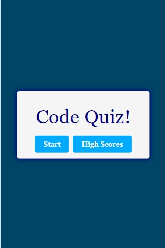
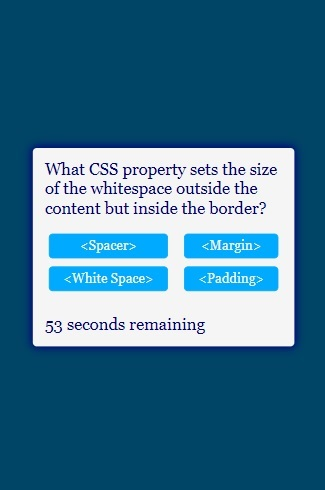

This application is a multiple choice coding quiz.
The user has 60 seconds to complete the quiz before time is up.
There is a 5 second time deduction for every incorrect answer.
The seconds remaining is the user's score.
The score is recoreded on the High Scores page.

The application can be found at:  https://rebecca-diroll.github.io/04-Code-Quiz/

